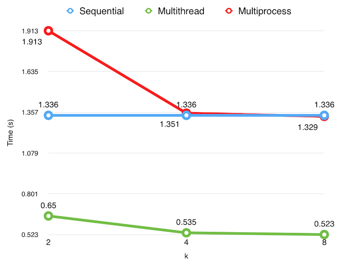

**Teste 1 - Revisão sobre Processos e Memória Compartilhada**
**Julianny Favinha Donda (156059)**

**Avaliação de desempenho**

**Versão sequencial** de 0 a N*2ˆ20, gera um número aleatório (usando a função rand()) e soma em uma variável cumulative&#95;sum. Por fim, calcula a média aritmética.

**Versão multithread** utiliza k threads. Cada thread gera uma fatia de números aleatórios (usando a função rand&#95;r(), que é _thread safe_) e soma esses elementos em uma variável partial&#95;sum. Após feita essa soma, usando mutex, o valor de partial&#95;sum é acrescentado à variável sum. Finalmente, calculamos a média aritmética.

**Versão processo** utiliza k processos. Cada processo gera uma fatia de números aleatórios (usando a função rand()), colocando cada um em sua posição correta no vetor de memória compartilhada ptr&#95;cumulative&#95;sum. Após isso,  soma as k somas cumulativas de modo sequencial e calcula a média aritmética. 

Tanto para a versão multithread quanto para a versão processo, a fatia de números para cada thread/processo foi calculada da seguinte maneira:

Seja i o número da thread ou processo. Então i é responsável por

* i&ast;(N/k) números, exceto o último i que é responsável por

* N - i&ast;(N/k) números

É esperado que com o aumento de k, o tempo de execução da versão sequencial seja constante e nas versões multithread e multiprocesso o tempo diminua, já que o trabalho é dividido.

**Gráfico**

