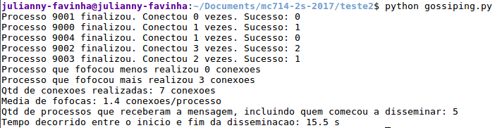

#### Teste 2 - Disseminação de informação
###### Julianny Favinha Donda (156059)

O algoritmo é dividido em N processos. Cada processo é dividido em 2 threads, chamadas de _client_ e _server_. A thread _client_ se conecta (usando protocolo TCP) com algum outro processo, escolhido aleatoriamente, e envia a mensagem. A thread _server_ recebe a mensagem e responde se já possuia a mensagem ou não. Se o processo não possuia a informação, então é atualizado com a informação recebida. Note que um processo começa a disseminar somente após possuir a mensagem. Foi usado ZeroMQ para a troca de mensagens. As funções principais de zmq foram _recv_, para receber uma mensagem, e _send_, para enviar uma mensagem. No caso do _recv_, foi constatado que é uma função bloqueante, ou seja, o processo fica parado nessa função até receber uma mensagem de fato. Para contornar esse problema, foi necessário usar a flag NOBLOCK, que força o _recv_ a não bloquear, se não houver uma mensagem pronta para ser recebida. Em compensação, foi feito um loop com timeout para conseguir receber a mensagem. Além desse timeout, Tanto a thread _client_ quanto a thread _server_ possuem um timeout "global", para não ficarem escutando conexões nem enviando mensagens indefinidamente, pois espera-se que depois de um tempo, uma quantia razoável de processos já tenha a informação. Esse timeout foi escolhido de maneira mais ou menos proporcional ao número de processos. A linguagem escolhida foi Python. Para N = 5 e k = 4, a saída do programa gossiping.py tem a seguinte estrutura:

#### Avaliação do algoritmo baseada em N e k
##### N = 500, k = 2 (_Vide arquivo gossiping-n500-k2.out_ )
**• Quantas vezes cada processo tentou fofocar (min, max, média)?** Min = 0 conexões, Max = 15 conexões, Média = 2.8 conexões

**• Qual parcela de tentativas de fofoca teve sucesso?** Foram realizadas 1383 conexões, e 471 sucessos. Logo, aproximadamente 34%.

**• No final da disseminação (quando todos os hosts pararam de fofocar), quantos processos tem a informação disseminada?** Ao final da disseminação, 472 processos possuem a informação.

**• Quanto tempo passou entre o início e o final da disseminação?** 53.0 segundos.

##### N = 500, k = 8 (_Vide arquivo gossiping-n500-k8.out_ )
**• Quantas vezes cada processo tentou fofocar (min, max, média)?** Min = 1 conexões, Max = 43 conexões, Média = 8.1 conexões

**• Qual parcela de tentativas de fofoca teve sucesso?** Foram realizadas 4067 conexões, e 494 sucessos. Logo, aproximadamente 12%.

**• No final da disseminação (quando todos os hosts pararam de fofocar), quantos processos tem a informação disseminada?** Ao final da disseminação, 495 processos possuem a informação.

**• Quanto tempo passou entre o início e o final da disseminação?** 106.5 segundos.

##### N = 1000, k = 2 (_Vide arquivo gossiping-n1000-k2.out_ )
**• Quantas vezes cada processo tentou fofocar (min, max, média)?** Min = 0 conexões, Max = 16 conexões, Média = 2.6 conexões

**• Qual parcela de tentativas de fofoca teve sucesso?** Foram realizadas 2759 conexões, e 923 sucessos. Logo, aproximadamente 33%.

**• No final da disseminação (quando todos os hosts pararam de fofocar), quantos processos tem a informação disseminada?** Ao final da disseminação, 924 processos possuem a informação.

**• Quanto tempo passou entre o início e o final da disseminação?** 47.6 segundos.

##### N = 1000, k = 4 (_Vide arquivo gossiping-n1000-k4.out_ )
**• Quantas vezes cada processo tentou fofocar (min, max, média)?** Min = 0 conexões, Max = 25 conexões, Média = 4.8 conexões

**• Qual parcela de tentativas de fofoca teve sucesso?** Foram realizadas 4805 conexões, e 985 sucessos. Logo, aproximadamente 20%.

**• No final da disseminação (quando todos os hosts pararam de fofocar), quantos processos tem a informação disseminada?** Ao final da disseminação, 986 processos possuem a informação.

**• Quanto tempo passou entre o início e o final da disseminação?** 75.2 segundos.
